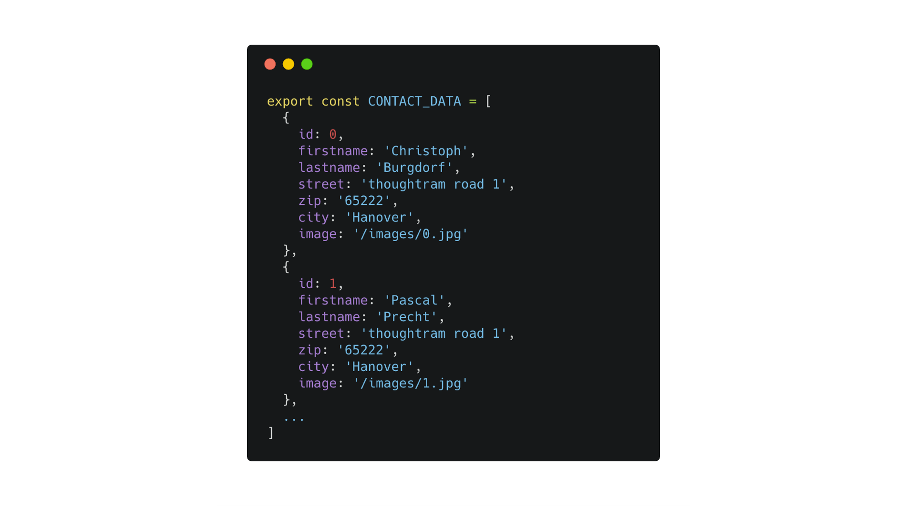

### Exercise 1: How to create a new component with loop 
Similar to heroes.componen
The below is an example of contacts. So far we have 2 contacts 
Step 1. Create const [] as below:



Step 2: Create (`ng new `) a new component called contacts.component 

Step 3: Similar to heros, loop all contacts and display on the page. 
Use https://www.w3schools.com/tags/tryit.asp?filename=tryhtml_lists4, 
Create simple list of contact: 
```html
<ul>
  <li>Christoph Burgdorf</li>
</ul>
```
